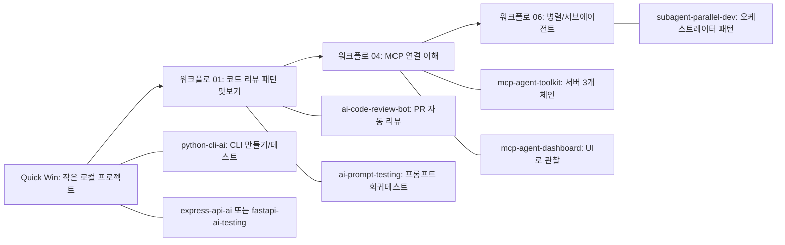

# EASY START GUIDE (쉬운 것부터 따라하기)

> `HANDS-ON-GUIDE.md`의 6개 워크플로를 기준으로 `examples/`를 비교해서, **가장 쉬운 것부터** 따라할 수 있게 재구성한 가이드입니다.
>
> 참고: 원래는 PNG 이미지를 같이 넣어드리려 했는데, 현재 세션에서는 이미지 생성 기능을 사용할 수 없어 **Mermaid 다이어그램(=문서 내 “이미지 대체”)**로 제공합니다.

---

## 이 문서의 목표

- **처음 30분 안에 “작동하는 결과물”을 1개 이상 만든다**
- `HANDS-ON-GUIDE.md`의 핵심 패턴(리뷰/디버깅/리팩토링/MCP/훅/병렬)을 `examples/` 예제로 **연결해서 이해한다**
- 이후에는 관심 분야(봇/웹/CLI/대시보드)로 자연스럽게 확장한다

---

## HANDS-ON ↔ examples 매핑 (비교 분석)

| HANDS-ON 워크플로 | 핵심 능력 | 매핑되는 `examples/` | 난이도 |
|---|---|---|---|
| 01 AI 코드 리뷰 | 변경사항 리뷰/PR 설명 | `examples/ai-code-review-bot/` , `examples/ai-prompt-testing/` | 중 |
| 02 AI 디버깅 | 에러 컨텍스트/파이프 전달 | (특정 1개 예제로 고정되기보단, 아래 “공통 프롬프트 템플릿”으로 모든 예제에 적용) | 쉬움 |
| 03 AI 리팩토링 | 분석→계획→단계 실행 | (예제 전반에 적용) | 쉬움~중 |
| 04 MCP 도구 연결 | MCP 서버 연결/도구체인 | `examples/mcp-agent-toolkit/` , `examples/mcp-agent-dashboard/` | 중~상 |
| 05 Hooks 자동화 | 자동 린트/위험명령 차단 | `HANDS-ON-GUIDE.md`가 가장 직접적(예제 폴더엔 전용 예제가 적음) | 중 |
| 06 서브에이전트 병렬 | 작업 분해/병렬 실행 | `examples/subagent-parallel-dev/` , `examples/crewai-multi-agent/` | 중 |

---

## 먼저 따라하기 좋은 순서 (Easy → Medium)

아래 로드맵은 “설치/외부 의존성 최소, 결과 확인 빠름” 기준입니다.



---

## 0) 공통 준비 (모든 예제 공통)

- **필수**: `claude --version`으로 Claude Code 동작 확인 (HANDS-ON 가정과 동일)
- **권장**: 예제는 대부분 Node/Python 기반이므로 아래 중 필요한 것만 설치
  - Node.js (예: Next.js/MCP/봇/Actions 예제)
  - Python 3.12+ (CLI/테스트 예제)

---

## 1) Quick Win: 가장 쉬운 예제 2개

### 1-A. `examples/python-cli-ai/` (추천 1순위)

**왜 쉽나?**
- 외부 API/토큰/웹서버 없이도 로컬에서 바로 실행/검증 가능
- `CLAUDE.md`로 “규칙을 고정”하는 감각을 가장 빨리 익힘

**따라하기 체크리스트**
- [ ] `examples/python-cli-ai/README.md`의 Step 1~7을 그대로 따라간다
- [ ] “테스트 작성” 파트까지 최소 1개 테스트를 실제로 실행한다
- [ ] 아래 디버깅 프롬프트 템플릿을 한 번 써본다

**디버깅 프롬프트 템플릿 (HANDS-ON 워크플로 02 적용)**

```text
다음 에러를 분석해줘. (수정하지 말고 원인부터)

- 실행 명령:
- 실제 출력(전체):
- 기대 동작:
- 작업한 파일:
```

---

### 1-B. `examples/express-api-ai/` 또는 `examples/fastapi-ai-testing/`

**선택 기준**
- TypeScript로 API 흐름을 익히고 싶으면 → `express-api-ai`
- 테스트 자동 생성/픽스처 패턴을 익히고 싶으면 → `fastapi-ai-testing`

**핵심 포인트**
- 이 단계는 HANDS-ON의 워크플로 02(디버깅), 03(리팩토링)을 “실제 코드”에 적용해보는 연습입니다.

---

## 2) 워크플로 01 (AI 코드 리뷰)로 확장

여기서부터는 “내가 만든 변경사항을 자동으로 검토하고, 설명/요약을 생산”하는 단계입니다.

### 2-A. `examples/ai-code-review-bot/`

**HANDS-ON과의 차이**
- HANDS-ON은 “내 로컬 브랜치에서 셀프 리뷰”에 집중
- 이 예제는 “GitHub Actions에서 PR diff를 추출해 자동 코멘트”까지 확장

**추천 학습 순서**
- [ ] HANDS-ON 워크플로 01의 “Step 2. AI 셀프 리뷰 실행”을 먼저 해본다
- [ ] 그다음 `ai-code-review-bot`의 “Actions 파이프라인”을 읽고 구조를 이해한다

### 2-B. `examples/ai-prompt-testing/`

**왜 같이 보나?**
- 코드 리뷰/테스트 생성 같은 “프롬프트”도 변경이 쌓이면 품질이 흔들립니다.
- 이 예제는 프롬프트를 “코드처럼 회귀 테스트”하는 방법을 제공합니다.

---

## 3) 워크플로 04 (MCP)로 확장

MCP는 **“AI가 외부 도구를 안정적으로 호출”**하게 만드는 관문이라 난이도가 올라갑니다. 대신 확장성이 큽니다.

### 3-A. `examples/mcp-agent-toolkit/` (먼저)

**핵심 요약**
- 파일/깃/DB를 **서버 3개로 분리**하고
- 각 서버는 **입력 스키마(Zod)**와 **안전장치(경로 제한/SELECT 제한/위험 쿼리 차단)**를 둡니다.

### 3-B. `examples/mcp-agent-dashboard/` (그다음)

**왜 다음인가?**
- MCP를 “연결했다”에서 끝내지 않고,
- **SSE로 상태/로그를 관찰**하는 UI까지 가면 운영 감각이 생깁니다.

---

## 4) 워크플로 06 (서브에이전트 병렬)로 확장

### 4-A. `examples/subagent-parallel-dev/`

**HANDS-ON과의 연결**
- HANDS-ON 워크플로 06의 “병렬 분해 프롬프트 패턴”을 실제 프로젝트 구조로 확장한 예제입니다.
- 특히 “공유 계약(Contract)을 먼저 확정”한 뒤 분배하는 규칙이 핵심입니다.

**실전 체크리스트**
- [ ] “병렬 처리에 적합/부적합 작업” 구분 기준을 읽고 내 작업에 적용한다
- [ ] 오케스트레이터 프롬프트에서 “파일 범위 겹침 금지” 규칙을 가져다 쓴다

---

## 5) 워크플로 05 (Hooks 자동화) — 예제 대비 HANDS-ON이 더 직접적

`examples/`에는 Hook 전용 예제가 많지 않아서, 이 파트는 `HANDS-ON-GUIDE.md`를 그대로 따라가는 게 가장 빠릅니다.

**추천 최소 목표**
- [ ] PostToolUse로 “파일 수정 후 자동 린트 1개”만 먼저 성공
- [ ] PreToolUse로 “위험 명령 차단 1개”만 먼저 성공

---

## 빠른 점검: 내가 지금 어디까지 했나

- [ ] 로컬에서 바로 실행되는 예제 1개를 만들었다 (`python-cli-ai` 추천)
- [ ] 에러를 “분석→검증→수정” 순서로 처리해봤다 (워크플로 02)
- [ ] 작은 리팩토링을 “단계 커밋” 방식으로 해봤다 (워크플로 03)
- [ ] 코드 리뷰 프롬프트(또는 봇)를 통해 리뷰를 자동화해봤다 (워크플로 01)
- [ ] MCP로 도구 연결을 최소 1개 성공했다 (워크플로 04)
- [ ] 병렬 분해 규칙(공유 계약/파일 범위)을 적용해봤다 (워크플로 06)

